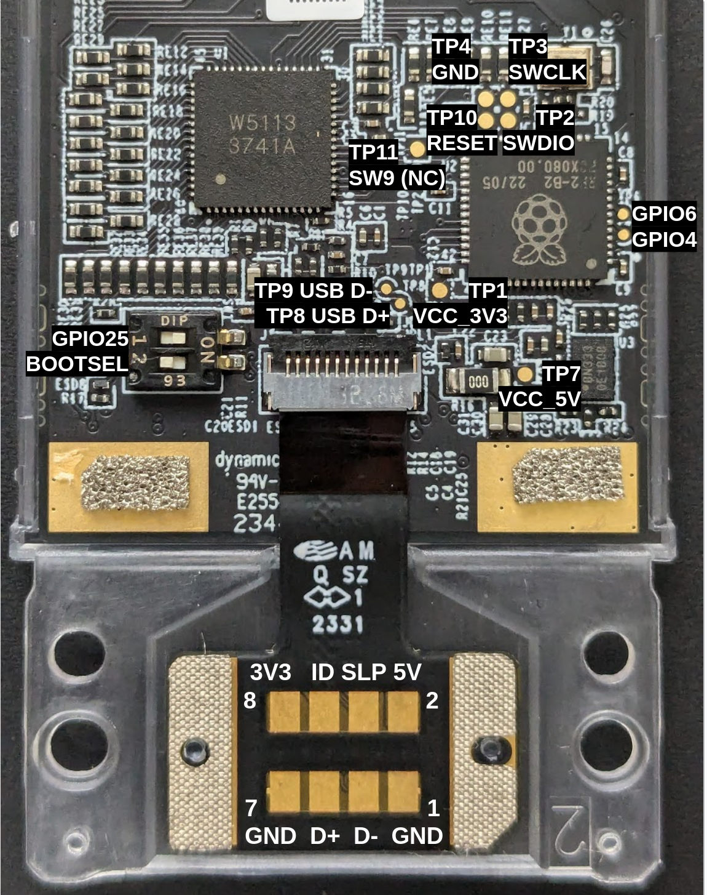

# LED Matrix Input Module
This is a 34x9 LED Matrix powered by a Raspberry Pi RP2040 microcontroller.

## Pre-production Unit

Note that the KiCAD version of this project is incomplete and untested, and is only provided as a reference.

The Atemitech prototype was made and tested, but is missing
use of the #SLEEP signal in the current revision.
It is not the version that is shipping to customers.

## Mass Production Unit

Below are the pinouts of the mass production units.

###### RP2040 MCU Pinouts

| Pin    | Name     | To         | Direction | Config             |
|--------|----------|------------|-----------|--------------------|
| GPIO0  | Sleep    | EC         | IN        | Pullup, low active |
| GPIO25 | DIP1     | DIP Switch | IN        | Pullup             |
| GPIO26 | I2C1_SDA | IS31FL3741 | IN/OUT    |                    |
| GPIO27 | I2C1_SCL | IS31FL3741 | OUT       |                    |
| GPIO28 | INTB     | IS31FL3741 | IN        | Floating (unused)  |
| GPIO29 | SDB      | IS31FL3741 | OUT       | High active        |

###### Test Pads

| Pad  | Name     | Function   |
|------|----------|------------|
| TP1  | VCC_3V3  |            |
| TP2  | SWDIO    | SWD Debug  |
| TP3  | SWCLK    | SWD Debug  |
| TP4  | GND      | SWD Debug  |
| TP5  | GPIO4    |            |
| TP6  | GPIO5    |            |
| TP7  | VCC_5V   |            |
| TP8  | USB DP   | USB 2.0    |
| TP9  | USB DM   | USB 2.0    |
| TP10 | RESET    |            |
| TP11 | SW9      |            |
| DIP1 | GPIO25   |            |
| DIP2 | BOOTSEL  |            |

TP2-4 are used for SWD debugging and can be used with [picoprobe](https://www.raspberrypi.com/documentation/microcontrollers/debug-probe.html) or similar.

RESET and BOOTSEL are also useful. If RESET is shorted to GND it resets the RP2040.
If BOOTSEL is shorted to GND while the RP2040 comes out of reset, it boots into UF2 bootlaoder for firmware update.

###### IS31FL3741 LED Controller

[Documentation](https://www.lumissil.com/applications/industrial/appliance/major-appliances/range-hood/is31fl3741a)
and [Datasheet](https://www.lumissil.com/assets/pdf/core/IS31FL3741A_DS.pdf)
of this controller are publicly available.

It drives a matrix of 9x34 (306) LEDs.

| Pin      | To          | Direction | Config            |
|----------|-------------|-----------|-------------------|
| SDA      | RP2040      | IN/OUT    |                   |
| SCL      | RP2040      | IN        |                   |
| INTB     | RP2040      | OUT       | Floating (unused) |
| SDB      | RP2040      | IN        | High active       |
| ISET     | 27k to GND  |           |                   |
| ADDR     | 100k to GND |           |                   |
| SW1-SW8  | LED         | OUT       | See table below   |
| SW9      | NC          |           | Unused            |
| CS1-CS39 | LED         | OUT       | See table below   |

The ISET and ADDR wiring results in I2C Address 0x30.

Below is the table describing how the LEDs are placed on the matrix
and how they are wired up to the LED controller.

- X is the X location in the matrix (from left to right)
- Y is the Y location in the matrix (from bottom to top)
- ID is the numerical identifier of the LED
- Address and Page describe the memory location in the IS31FL3741's registers
- SW and CS are the pins

Please refer to the controller's datasheet for additional information about how to
program it.

| X | Y  | ID  | Address | Page | SW | CS |
|---|----|-----|---------|------|----|----|
| 1 | 1  | 1   | 0x00    | 0    | 1  | 1  |
| 2 | 1  | 2   | 0x1e    | 0    | 2  | 1  |
| 3 | 1  | 3   | 0x3c    | 0    | 3  | 1  |
| 4 | 1  | 4   | 0x5a    | 0    | 4  | 1  |
| 5 | 1  | 5   | 0x78    | 0    | 5  | 1  |
| 6 | 1  | 6   | 0x96    | 0    | 6  | 1  |
| 7 | 1  | 7   | 0x00    | 1    | 7  | 1  |
| 8 | 1  | 8   | 0x1e    | 1    | 8  | 1  |
| 9 | 1  | 9   | 0x5f    | 1    | 1  | 36 |
| 1 | 2  | 10  | 0x01    | 0    | 1  | 2  |
| 2 | 2  | 11  | 0x1f    | 0    | 2  | 2  |
| 3 | 2  | 12  | 0x3d    | 0    | 3  | 2  |
| 4 | 2  | 13  | 0x5b    | 0    | 4  | 2  |
| 5 | 2  | 14  | 0x79    | 0    | 5  | 2  |
| 6 | 2  | 15  | 0x97    | 0    | 6  | 2  |
| 7 | 2  | 16  | 0x01    | 1    | 7  | 2  |
| 8 | 2  | 17  | 0x1f    | 1    | 8  | 2  |
| 9 | 2  | 18  | 0x60    | 1    | 1  | 37 |
| 1 | 3  | 19  | 0x02    | 0    | 1  | 3  |
| 2 | 3  | 20  | 0x20    | 0    | 2  | 3  |
| 3 | 3  | 21  | 0x3e    | 0    | 3  | 3  |
| 4 | 3  | 22  | 0x5c    | 0    | 4  | 3  |
| 5 | 3  | 23  | 0x7a    | 0    | 5  | 3  |
| 6 | 3  | 24  | 0x98    | 0    | 6  | 3  |
| 7 | 3  | 25  | 0x02    | 1    | 7  | 3  |
| 8 | 3  | 26  | 0x20    | 1    | 8  | 3  |
| 9 | 3  | 27  | 0x61    | 1    | 1  | 38 |
| 1 | 4  | 28  | 0x03    | 0    | 1  | 4  |
| 2 | 4  | 29  | 0x21    | 0    | 2  | 4  |
| 3 | 4  | 30  | 0x3f    | 0    | 3  | 4  |
| 4 | 4  | 31  | 0x5d    | 0    | 4  | 4  |
| 5 | 4  | 32  | 0x7b    | 0    | 5  | 4  |
| 6 | 4  | 33  | 0x99    | 0    | 6  | 4  |
| 7 | 4  | 34  | 0x03    | 1    | 7  | 4  |
| 8 | 4  | 35  | 0x21    | 1    | 8  | 4  |
| 9 | 4  | 36  | 0x62    | 1    | 1  | 39 |
| 1 | 5  | 37  | 0x04    | 0    | 1  | 5  |
| 2 | 5  | 41  | 0x22    | 0    | 2  | 5  |
| 3 | 5  | 45  | 0x40    | 0    | 3  | 5  |
| 4 | 5  | 49  | 0x5e    | 0    | 4  | 5  |
| 5 | 5  | 53  | 0x7c    | 0    | 5  | 5  |
| 6 | 5  | 57  | 0x9a    | 0    | 6  | 5  |
| 7 | 5  | 61  | 0x04    | 1    | 7  | 5  |
| 8 | 5  | 65  | 0x22    | 1    | 8  | 5  |
| 9 | 5  | 69  | 0x5e    | 1    | 1  | 35 |
| 1 | 6  | 38  | 0x05    | 0    | 1  | 6  |
| 2 | 6  | 42  | 0x23    | 0    | 2  | 6  |
| 3 | 6  | 46  | 0x41    | 0    | 3  | 6  |
| 4 | 6  | 50  | 0x5f    | 0    | 4  | 6  |
| 5 | 6  | 54  | 0x7d    | 0    | 5  | 6  |
| 6 | 6  | 58  | 0x9b    | 0    | 6  | 6  |
| 7 | 6  | 62  | 0x05    | 1    | 7  | 6  |
| 8 | 6  | 66  | 0x23    | 1    | 8  | 6  |
| 9 | 6  | 70  | 0x68    | 1    | 2  | 36 |
| 1 | 7  | 39  | 0x06    | 0    | 1  | 7  |
| 2 | 7  | 43  | 0x24    | 0    | 2  | 7  |
| 3 | 7  | 47  | 0x42    | 0    | 3  | 7  |
| 4 | 7  | 51  | 0x60    | 0    | 4  | 7  |
| 5 | 7  | 55  | 0x7e    | 0    | 5  | 7  |
| 6 | 7  | 59  | 0x9c    | 0    | 6  | 7  |
| 7 | 7  | 63  | 0x06    | 1    | 7  | 7  |
| 8 | 7  | 67  | 0x24    | 1    | 8  | 7  |
| 9 | 7  | 71  | 0x69    | 1    | 2  | 37 |
| 1 | 8  | 40  | 0x07    | 0    | 1  | 8  |
| 2 | 8  | 44  | 0x25    | 0    | 2  | 8  |
| 3 | 8  | 48  | 0x43    | 0    | 3  | 8  |
| 4 | 8  | 52  | 0x61    | 0    | 4  | 8  |
| 5 | 8  | 56  | 0x7f    | 0    | 5  | 8  |
| 6 | 8  | 60  | 0x9d    | 0    | 6  | 8  |
| 7 | 8  | 64  | 0x07    | 1    | 7  | 8  |
| 8 | 8  | 68  | 0x25    | 1    | 8  | 8  |
| 9 | 8  | 72  | 0x6a    | 1    | 2  | 38 |
| 1 | 9  | 73  | 0x08    | 0    | 1  | 9  |
| 2 | 9  | 81  | 0x26    | 0    | 2  | 9  |
| 3 | 9  | 89  | 0x44    | 0    | 3  | 9  |
| 4 | 9  | 97  | 0x62    | 0    | 4  | 9  |
| 5 | 9  | 105 | 0x80    | 0    | 5  | 9  |
| 6 | 9  | 113 | 0x9e    | 0    | 6  | 9  |
| 7 | 9  | 121 | 0x08    | 1    | 7  | 9  |
| 8 | 9  | 129 | 0x26    | 1    | 8  | 9  |
| 9 | 9  | 137 | 0x6b    | 1    | 2  | 39 |
| 1 | 10 | 74  | 0x09    | 0    | 1  | 10 |
| 2 | 10 | 82  | 0x27    | 0    | 2  | 10 |
| 3 | 10 | 90  | 0x45    | 0    | 3  | 10 |
| 4 | 10 | 98  | 0x63    | 0    | 4  | 10 |
| 5 | 10 | 106 | 0x81    | 0    | 5  | 10 |
| 6 | 10 | 114 | 0x9f    | 0    | 6  | 10 |
| 7 | 10 | 122 | 0x09    | 1    | 7  | 10 |
| 8 | 10 | 130 | 0x27    | 1    | 8  | 10 |
| 9 | 10 | 138 | 0x67    | 1    | 2  | 35 |
| 1 | 11 | 75  | 0x0a    | 0    | 1  | 11 |
| 2 | 11 | 83  | 0x28    | 0    | 2  | 11 |
| 3 | 11 | 91  | 0x46    | 0    | 3  | 11 |
| 4 | 11 | 99  | 0x64    | 0    | 4  | 11 |
| 5 | 11 | 107 | 0x82    | 0    | 5  | 11 |
| 6 | 11 | 115 | 0xa0    | 0    | 6  | 11 |
| 7 | 11 | 123 | 0x0a    | 1    | 7  | 11 |
| 8 | 11 | 131 | 0x28    | 1    | 8  | 11 |
| 9 | 11 | 139 | 0x71    | 1    | 3  | 36 |
| 1 | 12 | 76  | 0x0b    | 0    | 1  | 12 |
| 2 | 12 | 84  | 0x29    | 0    | 2  | 12 |
| 3 | 12 | 92  | 0x47    | 0    | 3  | 12 |
| 4 | 12 | 100 | 0x65    | 0    | 4  | 12 |
| 5 | 12 | 108 | 0x83    | 0    | 5  | 12 |
| 6 | 12 | 116 | 0xa1    | 0    | 6  | 12 |
| 7 | 12 | 124 | 0x0b    | 1    | 7  | 12 |
| 8 | 12 | 132 | 0x29    | 1    | 8  | 12 |
| 9 | 12 | 140 | 0x72    | 1    | 3  | 37 |
| 1 | 13 | 77  | 0x0c    | 0    | 1  | 13 |
| 2 | 13 | 85  | 0x2a    | 0    | 2  | 13 |
| 3 | 13 | 93  | 0x48    | 0    | 3  | 13 |
| 4 | 13 | 101 | 0x66    | 0    | 4  | 13 |
| 5 | 13 | 109 | 0x84    | 0    | 5  | 13 |
| 6 | 13 | 117 | 0xa2    | 0    | 6  | 13 |
| 7 | 13 | 125 | 0x0c    | 1    | 7  | 13 |
| 8 | 13 | 133 | 0x2a    | 1    | 8  | 13 |
| 9 | 13 | 141 | 0x73    | 1    | 3  | 38 |
| 1 | 14 | 78  | 0x0d    | 0    | 1  | 14 |
| 2 | 14 | 86  | 0x2b    | 0    | 2  | 14 |
| 3 | 14 | 94  | 0x49    | 0    | 3  | 14 |
| 4 | 14 | 102 | 0x67    | 0    | 4  | 14 |
| 5 | 14 | 110 | 0x85    | 0    | 5  | 14 |
| 6 | 14 | 118 | 0xa3    | 0    | 6  | 14 |
| 7 | 14 | 126 | 0x0d    | 1    | 7  | 14 |
| 8 | 14 | 134 | 0x2b    | 1    | 8  | 14 |
| 9 | 14 | 142 | 0x70    | 1    | 3  | 35 |
| 1 | 15 | 79  | 0x0e    | 0    | 1  | 15 |
| 2 | 15 | 87  | 0x2c    | 0    | 2  | 15 |
| 3 | 15 | 95  | 0x4a    | 0    | 3  | 15 |
| 4 | 15 | 103 | 0x68    | 0    | 4  | 15 |
| 5 | 15 | 111 | 0x86    | 0    | 5  | 15 |
| 6 | 15 | 119 | 0xa4    | 0    | 6  | 15 |
| 7 | 15 | 127 | 0x0e    | 1    | 7  | 15 |
| 8 | 15 | 135 | 0x2c    | 1    | 8  | 15 |
| 9 | 15 | 143 | 0x7a    | 1    | 4  | 36 |
| 1 | 16 | 80  | 0x0f    | 0    | 1  | 16 |
| 2 | 16 | 88  | 0x2d    | 0    | 2  | 16 |
| 3 | 16 | 96  | 0x4b    | 0    | 3  | 16 |
| 4 | 16 | 104 | 0x69    | 0    | 4  | 16 |
| 5 | 16 | 112 | 0x87    | 0    | 5  | 16 |
| 6 | 16 | 120 | 0xa5    | 0    | 6  | 16 |
| 7 | 16 | 128 | 0x0f    | 1    | 7  | 16 |
| 8 | 16 | 136 | 0x2d    | 1    | 8  | 16 |
| 9 | 16 | 144 | 0x7b    | 1    | 4  | 37 |
| 1 | 17 | 145 | 0x10    | 0    | 1  | 17 |
| 2 | 17 | 161 | 0x2e    | 0    | 2  | 17 |
| 3 | 17 | 177 | 0x4c    | 0    | 3  | 17 |
| 4 | 17 | 193 | 0x6a    | 0    | 4  | 17 |
| 5 | 17 | 209 | 0x88    | 0    | 5  | 17 |
| 6 | 17 | 225 | 0xa6    | 0    | 6  | 17 |
| 7 | 17 | 241 | 0x10    | 1    | 7  | 17 |
| 8 | 17 | 257 | 0x2e    | 1    | 8  | 17 |
| 9 | 17 | 273 | 0x7c    | 1    | 4  | 38 |
| 1 | 18 | 146 | 0x11    | 0    | 1  | 18 |
| 2 | 18 | 162 | 0x2f    | 0    | 2  | 18 |
| 3 | 18 | 178 | 0x4d    | 0    | 3  | 18 |
| 4 | 18 | 194 | 0x6b    | 0    | 4  | 18 |
| 5 | 18 | 210 | 0x89    | 0    | 5  | 18 |
| 6 | 18 | 226 | 0xa7    | 0    | 6  | 18 |
| 7 | 18 | 242 | 0x11    | 1    | 7  | 18 |
| 8 | 18 | 258 | 0x2f    | 1    | 8  | 18 |
| 9 | 18 | 274 | 0x79    | 1    | 4  | 35 |
| 1 | 19 | 147 | 0x12    | 0    | 1  | 19 |
| 2 | 19 | 163 | 0x30    | 0    | 2  | 19 |
| 3 | 19 | 179 | 0x4e    | 0    | 3  | 19 |
| 4 | 19 | 195 | 0x6c    | 0    | 4  | 19 |
| 5 | 19 | 211 | 0x8a    | 0    | 5  | 19 |
| 6 | 19 | 227 | 0xa8    | 0    | 6  | 19 |
| 7 | 19 | 243 | 0x12    | 1    | 7  | 19 |
| 8 | 19 | 259 | 0x30    | 1    | 8  | 19 |
| 9 | 19 | 275 | 0x83    | 1    | 5  | 36 |
| 1 | 20 | 148 | 0x13    | 0    | 1  | 20 |
| 2 | 20 | 164 | 0x31    | 0    | 2  | 20 |
| 3 | 20 | 180 | 0x4f    | 0    | 3  | 20 |
| 4 | 20 | 196 | 0x6d    | 0    | 4  | 20 |
| 5 | 20 | 212 | 0x8b    | 0    | 5  | 20 |
| 6 | 20 | 228 | 0xa9    | 0    | 6  | 20 |
| 7 | 20 | 244 | 0x13    | 1    | 7  | 20 |
| 8 | 20 | 260 | 0x31    | 1    | 8  | 20 |
| 9 | 20 | 276 | 0x84    | 1    | 5  | 37 |
| 1 | 21 | 149 | 0x14    | 0    | 1  | 21 |
| 2 | 21 | 165 | 0x32    | 0    | 2  | 21 |
| 3 | 21 | 181 | 0x50    | 0    | 3  | 21 |
| 4 | 21 | 197 | 0x6e    | 0    | 4  | 21 |
| 5 | 21 | 213 | 0x8c    | 0    | 5  | 21 |
| 6 | 21 | 229 | 0xaa    | 0    | 6  | 21 |
| 7 | 21 | 245 | 0x14    | 1    | 7  | 21 |
| 8 | 21 | 261 | 0x32    | 1    | 8  | 21 |
| 9 | 21 | 277 | 0x85    | 1    | 5  | 38 |
| 1 | 22 | 150 | 0x15    | 0    | 1  | 22 |
| 2 | 22 | 166 | 0x33    | 0    | 2  | 22 |
| 3 | 22 | 182 | 0x51    | 0    | 3  | 22 |
| 4 | 22 | 198 | 0x6f    | 0    | 4  | 22 |
| 5 | 22 | 214 | 0x8d    | 0    | 5  | 22 |
| 6 | 22 | 230 | 0xab    | 0    | 6  | 22 |
| 7 | 22 | 246 | 0x15    | 1    | 7  | 22 |
| 8 | 22 | 262 | 0x33    | 1    | 8  | 22 |
| 9 | 22 | 278 | 0x82    | 1    | 5  | 35 |
| 1 | 23 | 151 | 0x16    | 0    | 1  | 23 |
| 2 | 23 | 167 | 0x34    | 0    | 2  | 23 |
| 3 | 23 | 183 | 0x52    | 0    | 3  | 23 |
| 4 | 23 | 199 | 0x70    | 0    | 4  | 23 |
| 5 | 23 | 215 | 0x8e    | 0    | 5  | 23 |
| 6 | 23 | 231 | 0xac    | 0    | 6  | 23 |
| 7 | 23 | 247 | 0x16    | 1    | 7  | 23 |
| 8 | 23 | 263 | 0x34    | 1    | 8  | 23 |
| 9 | 23 | 279 | 0x8c    | 1    | 6  | 36 |
| 1 | 24 | 152 | 0x17    | 0    | 1  | 24 |
| 2 | 24 | 168 | 0x35    | 0    | 2  | 24 |
| 3 | 24 | 184 | 0x53    | 0    | 3  | 24 |
| 4 | 24 | 200 | 0x71    | 0    | 4  | 24 |
| 5 | 24 | 216 | 0x8f    | 0    | 5  | 24 |
| 6 | 24 | 232 | 0xad    | 0    | 6  | 24 |
| 7 | 24 | 248 | 0x17    | 1    | 7  | 24 |
| 8 | 24 | 264 | 0x35    | 1    | 8  | 24 |
| 9 | 24 | 280 | 0x8d    | 1    | 6  | 37 |
| 1 | 25 | 153 | 0x18    | 0    | 1  | 25 |
| 2 | 25 | 169 | 0x36    | 0    | 2  | 25 |
| 3 | 25 | 185 | 0x54    | 0    | 3  | 25 |
| 4 | 25 | 201 | 0x72    | 0    | 4  | 25 |
| 5 | 25 | 217 | 0x90    | 0    | 5  | 25 |
| 6 | 25 | 233 | 0xae    | 0    | 6  | 25 |
| 7 | 25 | 249 | 0x18    | 1    | 7  | 25 |
| 8 | 25 | 265 | 0x36    | 1    | 8  | 25 |
| 9 | 25 | 281 | 0x8e    | 1    | 6  | 38 |
| 1 | 26 | 154 | 0x19    | 0    | 1  | 26 |
| 2 | 26 | 170 | 0x37    | 0    | 2  | 26 |
| 3 | 26 | 186 | 0x55    | 0    | 3  | 26 |
| 4 | 26 | 202 | 0x73    | 0    | 4  | 26 |
| 5 | 26 | 218 | 0x91    | 0    | 5  | 26 |
| 6 | 26 | 234 | 0xaf    | 0    | 6  | 26 |
| 7 | 26 | 250 | 0x19    | 1    | 7  | 26 |
| 8 | 26 | 266 | 0x37    | 1    | 8  | 26 |
| 9 | 26 | 282 | 0x8b    | 1    | 6  | 35 |
| 1 | 27 | 155 | 0x1a    | 0    | 1  | 27 |
| 2 | 27 | 171 | 0x38    | 0    | 2  | 27 |
| 3 | 27 | 187 | 0x56    | 0    | 3  | 27 |
| 4 | 27 | 203 | 0x74    | 0    | 4  | 27 |
| 5 | 27 | 219 | 0x92    | 0    | 5  | 27 |
| 6 | 27 | 235 | 0xb0    | 0    | 6  | 27 |
| 7 | 27 | 251 | 0x1a    | 1    | 7  | 27 |
| 8 | 27 | 267 | 0x38    | 1    | 8  | 27 |
| 9 | 27 | 283 | 0x95    | 1    | 7  | 36 |
| 1 | 28 | 156 | 0x1b    | 0    | 1  | 28 |
| 2 | 28 | 172 | 0x39    | 0    | 2  | 28 |
| 3 | 28 | 188 | 0x57    | 0    | 3  | 28 |
| 4 | 28 | 204 | 0x75    | 0    | 4  | 28 |
| 5 | 28 | 220 | 0x93    | 0    | 5  | 28 |
| 6 | 28 | 236 | 0xb1    | 0    | 6  | 28 |
| 7 | 28 | 252 | 0x1b    | 1    | 7  | 28 |
| 8 | 28 | 268 | 0x39    | 1    | 8  | 28 |
| 9 | 28 | 284 | 0x96    | 1    | 7  | 37 |
| 1 | 29 | 157 | 0x1c    | 0    | 1  | 29 |
| 2 | 29 | 173 | 0x3a    | 0    | 2  | 29 |
| 3 | 29 | 189 | 0x58    | 0    | 3  | 29 |
| 4 | 29 | 205 | 0x76    | 0    | 4  | 29 |
| 5 | 29 | 221 | 0x94    | 0    | 5  | 29 |
| 6 | 29 | 237 | 0xb2    | 0    | 6  | 29 |
| 7 | 29 | 253 | 0x1c    | 1    | 7  | 29 |
| 8 | 29 | 269 | 0x3a    | 1    | 8  | 29 |
| 9 | 29 | 285 | 0x97    | 1    | 7  | 38 |
| 1 | 30 | 158 | 0x1d    | 0    | 1  | 30 |
| 2 | 30 | 174 | 0x3b    | 0    | 2  | 30 |
| 3 | 30 | 190 | 0x59    | 0    | 3  | 30 |
| 4 | 30 | 206 | 0x77    | 0    | 4  | 30 |
| 5 | 30 | 222 | 0x95    | 0    | 5  | 30 |
| 6 | 30 | 238 | 0xb3    | 0    | 6  | 30 |
| 7 | 30 | 254 | 0x1d    | 1    | 7  | 30 |
| 8 | 30 | 270 | 0x3b    | 1    | 8  | 30 |
| 9 | 30 | 286 | 0x94    | 1    | 7  | 35 |
| 1 | 31 | 159 | 0x5a    | 1    | 1  | 31 |
| 2 | 31 | 175 | 0x63    | 1    | 2  | 31 |
| 3 | 31 | 191 | 0x6c    | 1    | 3  | 31 |
| 4 | 31 | 207 | 0x75    | 1    | 4  | 31 |
| 5 | 31 | 223 | 0x7e    | 1    | 5  | 31 |
| 6 | 31 | 239 | 0x87    | 1    | 6  | 31 |
| 7 | 31 | 255 | 0x90    | 1    | 7  | 31 |
| 8 | 31 | 271 | 0x99    | 1    | 8  | 31 |
| 9 | 31 | 287 | 0x9e    | 1    | 8  | 36 |
| 1 | 32 | 160 | 0x5b    | 1    | 1  | 32 |
| 2 | 32 | 176 | 0x64    | 1    | 2  | 32 |
| 3 | 32 | 192 | 0x6d    | 1    | 3  | 32 |
| 4 | 32 | 208 | 0x76    | 1    | 4  | 32 |
| 5 | 32 | 224 | 0x7f    | 1    | 5  | 32 |
| 6 | 32 | 240 | 0x88    | 1    | 6  | 32 |
| 7 | 32 | 256 | 0x91    | 1    | 7  | 32 |
| 8 | 32 | 272 | 0x9a    | 1    | 8  | 32 |
| 9 | 32 | 288 | 0x9f    | 1    | 8  | 37 |
| 1 | 33 | 289 | 0x5c    | 1    | 1  | 33 |
| 2 | 33 | 290 | 0x65    | 1    | 2  | 33 |
| 3 | 33 | 291 | 0x6e    | 1    | 3  | 33 |
| 4 | 33 | 292 | 0x77    | 1    | 4  | 33 |
| 5 | 33 | 293 | 0x80    | 1    | 5  | 33 |
| 6 | 33 | 294 | 0x89    | 1    | 6  | 33 |
| 7 | 33 | 295 | 0x92    | 1    | 7  | 33 |
| 8 | 33 | 296 | 0x9b    | 1    | 8  | 33 |
| 9 | 33 | 297 | 0xa0    | 1    | 8  | 38 |
| 1 | 34 | 298 | 0x5d    | 1    | 1  | 34 |
| 2 | 34 | 299 | 0x66    | 1    | 2  | 34 |
| 3 | 34 | 300 | 0x6f    | 1    | 3  | 34 |
| 4 | 34 | 301 | 0x78    | 1    | 4  | 34 |
| 5 | 34 | 302 | 0x81    | 1    | 5  | 34 |
| 6 | 34 | 303 | 0x8a    | 1    | 6  | 34 |
| 7 | 34 | 304 | 0x93    | 1    | 7  | 34 |
| 8 | 34 | 305 | 0x9c    | 1    | 8  | 34 |
| 9 | 34 | 306 | 0x9d    | 1    | 8  | 35 |

## License
Input Modules © 2023 by Framework Computer Inc is licensed under CC BY 4.0. To view a copy of this license, visit http://creativecommons.org/licenses/by/4.0/
