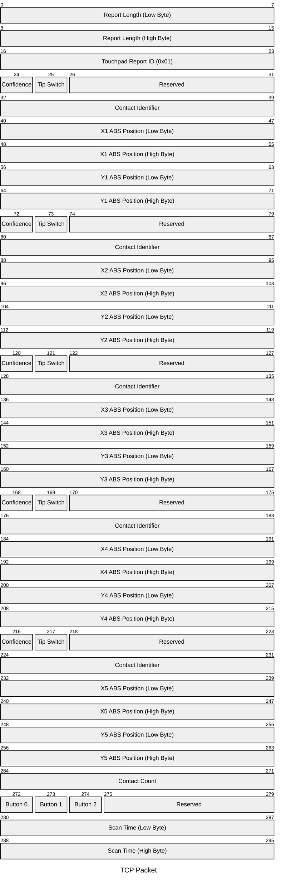
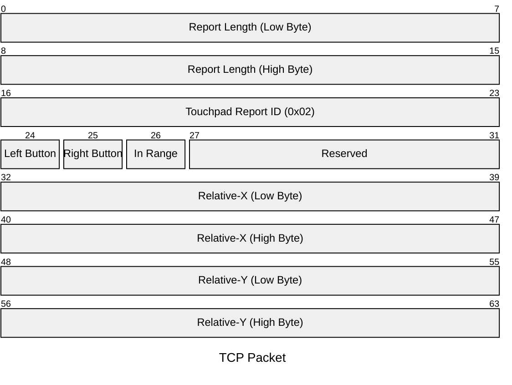

# Framework 16 Touchpad

For the pinout, check the hubboard's pinout, documented on the main [README](../../README.md).

## Silkscreen

| Label | Type      | Description    |
|-------|-----------|----------------|
| ID    | Testpoint | Board ID       |
| TG    | Testpoint | Ground         |
| TI    | Testpoint | I2C Interrupt  |
| LID   | Testpoint | Reserved       |
| TD    | Testpoint | I2C SDA        |
| TV    | Testpoint | 3.3V           |
| TC    | Testpoint | I2C SCL        |
| TB1   | Testpoint | Button         |
| J1    | Connector | FPC Connector  |
| U4    | IC        | Pixart PCT3854 |
| R1    | Resistor  | Board ID 560k  |
| R2    | Resistor  | I2C SDA Pullup |
| R3    | Resistor  | I2C SCL Pullup |

The I2C pullup resistors are unpopulated, they are present on the system side instead of the touchpad.
If you want to use the touchpad outside of the chassis, you can populate them.

## Firmware

The touchpad presents as an I2C HID device at address 0x2C.
Below the HID Report descriptor and details about some reports are documented.

### HID Reports

Report ID 1 - PTP (Precision Touchpad)



Report ID 2 - Mouse Mode



### HID Report Descriptor

```
# 0x05, 0x01,                    // Usage Page (Generic Desktop)        0
# 0x09, 0x02,                    // Usage (Mouse)                       2
# 0xa1, 0x01,                    // Collection (Application)            4
# 0x85, 0x01,                    //  Report ID (1)                      6
# 0x05, 0x01,                    //  Usage Page (Generic Desktop)       8
# 0x09, 0x01,                    //  Usage (Pointer)                    10
# 0xa1, 0x00,                    //  Collection (Physical)              12
# 0x05, 0x09,                    //   Usage Page (Button)               14
# 0x19, 0x01,                    //   Usage Minimum (1)                 16
# 0x29, 0x02,                    //   Usage Maximum (2)                 18
# 0x15, 0x00,                    //   Logical Minimum (0)               20
# 0x25, 0x01,                    //   Logical Maximum (1)               22
# 0x75, 0x01,                    //   Report Size (1)                   24
# 0x95, 0x02,                    //   Report Count (2)                  26
# 0x81, 0x02,                    //   Input (Data,Var,Abs)              28
# 0x95, 0x06,                    //   Report Count (6)                  30
# 0x81, 0x03,                    //   Input (Cnst,Var,Abs)              32
# 0x05, 0x01,                    //   Usage Page (Generic Desktop)      34
# 0x09, 0x30,                    //   Usage (X)                         36
# 0x09, 0x31,                    //   Usage (Y)                         38
# 0x09, 0x38,                    //   Usage (Wheel)                     40
# 0x15, 0x81,                    //   Logical Minimum (-127)            42
# 0x25, 0x7f,                    //   Logical Maximum (127)             44
# 0x75, 0x08,                    //   Report Size (8)                   46
# 0x95, 0x03,                    //   Report Count (3)                  48
# 0x81, 0x26,                    //   Input (Data,Var,Rel,NoPref)       50
# 0x05, 0x0c,                    //   Usage Page (Consumer Devices)     52
# 0x0a, 0x38, 0x02,              //   Usage (AC Pan)                    54
# 0x95, 0x01,                    //   Report Count (1)                  57
# 0x81, 0x06,                    //   Input (Data,Var,Rel)              59
# 0x75, 0x08,                    //   Report Size (8)                   61
# 0x95, 0x03,                    //   Report Count (3)                  63
# 0x81, 0x03,                    //   Input (Cnst,Var,Abs)              65
# 0xc0,                          //  End Collection                     67
# 0xc0,                          // End Collection                      68
# 0x05, 0x0d,                    // Usage Page (Digitizers)             69
# 0x09, 0x05,                    // Usage (Touch Pad)                   71
# 0xa1, 0x01,                    // Collection (Application)            73
# 0x85, 0x04,                    //  Report ID (4)                      75
# 0x05, 0x09,                    //  Usage Page (Button)                77
# 0x09, 0x01,                    //  Usage (Vendor Usage 0x01)          79
# 0x15, 0x00,                    //  Logical Minimum (0)                81
# 0x25, 0x01,                    //  Logical Maximum (1)                83
# 0x75, 0x01,                    //  Report Size (1)                    85
# 0x95, 0x01,                    //  Report Count (1)                   87
# 0x81, 0x02,                    //  Input (Data,Var,Abs)               89
# 0x95, 0x02,                    //  Report Count (2)                   91
# 0x81, 0x03,                    //  Input (Cnst,Var,Abs)               93
# 0x06, 0x01, 0xff,              //  Usage Page (Vendor Usage Page 0xff01) 95
# 0x09, 0x01,                    //  Usage (Vendor Usage 0x01)          98
# 0x95, 0x01,                    //  Report Count (1)                   100
# 0x81, 0x02,                    //  Input (Data,Var,Abs)               102
# 0x05, 0x0d,                    //  Usage Page (Digitizers)            104
# 0x09, 0x54,                    //  Usage (Contact Count)              106
# 0x25, 0x05,                    //  Logical Maximum (5)                108
# 0x75, 0x04,                    //  Report Size (4)                    110
# 0x95, 0x01,                    //  Report Count (1)                   112
# 0x81, 0x02,                    //  Input (Data,Var,Abs)               114
# 0x09, 0x56,                    //  Usage (Scan Time)                  116
# 0x55, 0x0c,                    //  Unit Exponent (-4)                 118
# 0x66, 0x01, 0x10,              //  Unit (SILinear: s)                 120
# 0x47, 0xff, 0xff, 0x00, 0x00,  //  Physical Maximum (65535)           123
# 0x27, 0xff, 0xff, 0x00, 0x00,  //  Logical Maximum (65535)            128
# 0x75, 0x10,                    //  Report Size (16)                   133
# 0x95, 0x01,                    //  Report Count (1)                   135
# 0x81, 0x02,                    //  Input (Data,Var,Abs)               137
# 0x05, 0x0d,                    //  Usage Page (Digitizers)            139
# 0x09, 0x22,                    //  Usage (Finger)                     141
# 0xa1, 0x02,                    //  Collection (Logical)               143
# 0x09, 0x47,                    //   Usage (Confidence)                145
# 0x09, 0x42,                    //   Usage (Tip Switch)                147
# 0x15, 0x00,                    //   Logical Minimum (0)               149
# 0x25, 0x01,                    //   Logical Maximum (1)               151
# 0x75, 0x01,                    //   Report Size (1)                   153
# 0x95, 0x02,                    //   Report Count (2)                  155
# 0x81, 0x02,                    //   Input (Data,Var,Abs)              157
# 0x95, 0x02,                    //   Report Count (2)                  159
# 0x81, 0x03,                    //   Input (Cnst,Var,Abs)              161
# 0x09, 0x51,                    //   Usage (Contact Id)                163
# 0x25, 0x0a,                    //   Logical Maximum (10)              165
# 0x75, 0x04,                    //   Report Size (4)                   167
# 0x95, 0x01,                    //   Report Count (1)                  169
# 0x81, 0x02,                    //   Input (Data,Var,Abs)              171
# 0x05, 0x01,                    //   Usage Page (Generic Desktop)      173
# 0x09, 0x30,                    //   Usage (X)                         175
# 0x35, 0x00,                    //   Physical Minimum (0)              177
# 0x46, 0xc4, 0x04,              //   Physical Maximum (1220)           179
# 0x26, 0x01, 0x0f,              //   Logical Maximum (3841)            182
# 0x55, 0x0e,                    //   Unit Exponent (-2)                185
# 0x65, 0x11,                    //   Unit (SILinear: cm)               187
# 0x75, 0x10,                    //   Report Size (16)                  189
# 0x95, 0x01,                    //   Report Count (1)                  191
# 0x81, 0x02,                    //   Input (Data,Var,Abs)              193
# 0x09, 0x31,                    //   Usage (Y)                         195
# 0x46, 0xf8, 0x02,              //   Physical Maximum (760)            197
# 0x26, 0x58, 0x09,              //   Logical Maximum (2392)            200
# 0x81, 0x02,                    //   Input (Data,Var,Abs)              203
# 0xc0,                          //  End Collection                     205
# 0x05, 0x0d,                    //  Usage Page (Digitizers)            206
# 0x09, 0x22,                    //  Usage (Finger)                     208
# 0xa1, 0x02,                    //  Collection (Logical)               210
# 0x09, 0x47,                    //   Usage (Confidence)                212
# 0x09, 0x42,                    //   Usage (Tip Switch)                214
# 0x15, 0x00,                    //   Logical Minimum (0)               216
# 0x25, 0x01,                    //   Logical Maximum (1)               218
# 0x75, 0x01,                    //   Report Size (1)                   220
# 0x95, 0x02,                    //   Report Count (2)                  222
# 0x81, 0x02,                    //   Input (Data,Var,Abs)              224
# 0x95, 0x02,                    //   Report Count (2)                  226
# 0x81, 0x03,                    //   Input (Cnst,Var,Abs)              228
# 0x09, 0x51,                    //   Usage (Contact Id)                230
# 0x25, 0x0a,                    //   Logical Maximum (10)              232
# 0x75, 0x04,                    //   Report Size (4)                   234
# 0x95, 0x01,                    //   Report Count (1)                  236
# 0x81, 0x02,                    //   Input (Data,Var,Abs)              238
# 0x05, 0x01,                    //   Usage Page (Generic Desktop)      240
# 0x09, 0x30,                    //   Usage (X)                         242
# 0x35, 0x00,                    //   Physical Minimum (0)              244
# 0x46, 0xc4, 0x04,              //   Physical Maximum (1220)           246
# 0x26, 0x01, 0x0f,              //   Logical Maximum (3841)            249
# 0x55, 0x0e,                    //   Unit Exponent (-2)                252
# 0x65, 0x11,                    //   Unit (SILinear: cm)               254
# 0x75, 0x10,                    //   Report Size (16)                  256
# 0x95, 0x01,                    //   Report Count (1)                  258
# 0x81, 0x02,                    //   Input (Data,Var,Abs)              260
# 0x09, 0x31,                    //   Usage (Y)                         262
# 0x46, 0xf8, 0x02,              //   Physical Maximum (760)            264
# 0x26, 0x58, 0x09,              //   Logical Maximum (2392)            267
# 0x81, 0x02,                    //   Input (Data,Var,Abs)              270
# 0xc0,                          //  End Collection                     272
# 0x05, 0x0d,                    //  Usage Page (Digitizers)            273
# 0x09, 0x22,                    //  Usage (Finger)                     275
# 0xa1, 0x02,                    //  Collection (Logical)               277
# 0x09, 0x47,                    //   Usage (Confidence)                279
# 0x09, 0x42,                    //   Usage (Tip Switch)                281
# 0x15, 0x00,                    //   Logical Minimum (0)               283
# 0x25, 0x01,                    //   Logical Maximum (1)               285
# 0x75, 0x01,                    //   Report Size (1)                   287
# 0x95, 0x02,                    //   Report Count (2)                  289
# 0x81, 0x02,                    //   Input (Data,Var,Abs)              291
# 0x95, 0x02,                    //   Report Count (2)                  293
# 0x81, 0x03,                    //   Input (Cnst,Var,Abs)              295
# 0x09, 0x51,                    //   Usage (Contact Id)                297
# 0x25, 0x0a,                    //   Logical Maximum (10)              299
# 0x75, 0x04,                    //   Report Size (4)                   301
# 0x95, 0x01,                    //   Report Count (1)                  303
# 0x81, 0x02,                    //   Input (Data,Var,Abs)              305
# 0x05, 0x01,                    //   Usage Page (Generic Desktop)      307
# 0x09, 0x30,                    //   Usage (X)                         309
# 0x35, 0x00,                    //   Physical Minimum (0)              311
# 0x46, 0xc4, 0x04,              //   Physical Maximum (1220)           313
# 0x26, 0x01, 0x0f,              //   Logical Maximum (3841)            316
# 0x55, 0x0e,                    //   Unit Exponent (-2)                319
# 0x65, 0x11,                    //   Unit (SILinear: cm)               321
# 0x75, 0x10,                    //   Report Size (16)                  323
# 0x95, 0x01,                    //   Report Count (1)                  325
# 0x81, 0x02,                    //   Input (Data,Var,Abs)              327
# 0x09, 0x31,                    //   Usage (Y)                         329
# 0x46, 0xf8, 0x02,              //   Physical Maximum (760)            331
# 0x26, 0x58, 0x09,              //   Logical Maximum (2392)            334
# 0x81, 0x02,                    //   Input (Data,Var,Abs)              337
# 0xc0,                          //  End Collection                     339
# 0x05, 0x0d,                    //  Usage Page (Digitizers)            340
# 0x09, 0x22,                    //  Usage (Finger)                     342
# 0xa1, 0x02,                    //  Collection (Logical)               344
# 0x09, 0x47,                    //   Usage (Confidence)                346
# 0x09, 0x42,                    //   Usage (Tip Switch)                348
# 0x15, 0x00,                    //   Logical Minimum (0)               350
# 0x25, 0x01,                    //   Logical Maximum (1)               352
# 0x75, 0x01,                    //   Report Size (1)                   354
# 0x95, 0x02,                    //   Report Count (2)                  356
# 0x81, 0x02,                    //   Input (Data,Var,Abs)              358
# 0x95, 0x02,                    //   Report Count (2)                  360
# 0x81, 0x03,                    //   Input (Cnst,Var,Abs)              362
# 0x09, 0x51,                    //   Usage (Contact Id)                364
# 0x25, 0x0a,                    //   Logical Maximum (10)              366
# 0x75, 0x04,                    //   Report Size (4)                   368
# 0x95, 0x01,                    //   Report Count (1)                  370
# 0x81, 0x02,                    //   Input (Data,Var,Abs)              372
# 0x05, 0x01,                    //   Usage Page (Generic Desktop)      374
# 0x09, 0x30,                    //   Usage (X)                         376
# 0x35, 0x00,                    //   Physical Minimum (0)              378
# 0x46, 0xc4, 0x04,              //   Physical Maximum (1220)           380
# 0x26, 0x01, 0x0f,              //   Logical Maximum (3841)            383
# 0x55, 0x0e,                    //   Unit Exponent (-2)                386
# 0x65, 0x11,                    //   Unit (SILinear: cm)               388
# 0x75, 0x10,                    //   Report Size (16)                  390
# 0x95, 0x01,                    //   Report Count (1)                  392
# 0x81, 0x02,                    //   Input (Data,Var,Abs)              394
# 0x09, 0x31,                    //   Usage (Y)                         396
# 0x46, 0xf8, 0x02,              //   Physical Maximum (760)            398
# 0x26, 0x58, 0x09,              //   Logical Maximum (2392)            401
# 0x81, 0x02,                    //   Input (Data,Var,Abs)              404
# 0xc0,                          //  End Collection                     406
# 0x05, 0x0d,                    //  Usage Page (Digitizers)            407
# 0x09, 0x22,                    //  Usage (Finger)                     409
# 0xa1, 0x02,                    //  Collection (Logical)               411
# 0x09, 0x47,                    //   Usage (Confidence)                413
# 0x09, 0x42,                    //   Usage (Tip Switch)                415
# 0x15, 0x00,                    //   Logical Minimum (0)               417
# 0x25, 0x01,                    //   Logical Maximum (1)               419
# 0x75, 0x01,                    //   Report Size (1)                   421
# 0x95, 0x02,                    //   Report Count (2)                  423
# 0x81, 0x02,                    //   Input (Data,Var,Abs)              425
# 0x95, 0x02,                    //   Report Count (2)                  427
# 0x81, 0x03,                    //   Input (Cnst,Var,Abs)              429
# 0x09, 0x51,                    //   Usage (Contact Id)                431
# 0x25, 0x0a,                    //   Logical Maximum (10)              433
# 0x75, 0x04,                    //   Report Size (4)                   435
# 0x95, 0x01,                    //   Report Count (1)                  437
# 0x81, 0x02,                    //   Input (Data,Var,Abs)              439
# 0x05, 0x01,                    //   Usage Page (Generic Desktop)      441
# 0x09, 0x30,                    //   Usage (X)                         443
# 0x35, 0x00,                    //   Physical Minimum (0)              445
# 0x46, 0xc4, 0x04,              //   Physical Maximum (1220)           447
# 0x26, 0x01, 0x0f,              //   Logical Maximum (3841)            450
# 0x55, 0x0e,                    //   Unit Exponent (-2)                453
# 0x65, 0x11,                    //   Unit (SILinear: cm)               455
# 0x75, 0x10,                    //   Report Size (16)                  457
# 0x95, 0x01,                    //   Report Count (1)                  459
# 0x81, 0x02,                    //   Input (Data,Var,Abs)              461
# 0x09, 0x31,                    //   Usage (Y)                         463
# 0x46, 0xf8, 0x02,              //   Physical Maximum (760)            465
# 0x26, 0x58, 0x09,              //   Logical Maximum (2392)            468
# 0x81, 0x02,                    //   Input (Data,Var,Abs)              471
# 0xc0,                          //  End Collection                     473
# 0x05, 0x0d,                    //  Usage Page (Digitizers)            474
# 0x85, 0x02,                    //  Report ID (2)                      476
# 0x09, 0x55,                    //  Usage (Contact Max)                478
# 0x15, 0x00,                    //  Logical Minimum (0)                480
# 0x25, 0x05,                    //  Logical Maximum (5)                482
# 0x75, 0x08,                    //  Report Size (8)                    484
# 0x95, 0x01,                    //  Report Count (1)                   486
# 0xb1, 0x02,                    //  Feature (Data,Var,Abs)             488
# 0x05, 0x0d,                    //  Usage Page (Digitizers)            490
# 0x85, 0x06,                    //  Report ID (6)                      492
# 0x09, 0x59,                    //  Usage (Button Type)                494
# 0x15, 0x00,                    //  Logical Minimum (0)                496
# 0x25, 0x0f,                    //  Logical Maximum (15)               498
# 0x75, 0x08,                    //  Report Size (8)                    500
# 0x95, 0x01,                    //  Report Count (1)                   502
# 0xb1, 0x02,                    //  Feature (Data,Var,Abs)             504
# 0x05, 0x0d,                    //  Usage Page (Digitizers)            506
# 0x85, 0x07,                    //  Report ID (7)                      508
# 0x09, 0x60,                    //  Usage (Vendor Usage 0x60)          510
# 0x15, 0x00,                    //  Logical Minimum (0)                512
# 0x25, 0x01,                    //  Logical Maximum (1)                514
# 0x75, 0x01,                    //  Report Size (1)                    516
# 0x95, 0x01,                    //  Report Count (1)                   518
# 0xb1, 0x02,                    //  Feature (Data,Var,Abs)             520
# 0x95, 0x0f,                    //  Report Count (15)                  522
# 0xb1, 0x03,                    //  Feature (Cnst,Var,Abs)             524
# 0x06, 0x00, 0xff,              //  Usage Page (Vendor Defined Page 1) 526
# 0x85, 0x0b,                    //  Report ID (11)                     529
# 0x09, 0xc5,                    //  Usage (Vendor Usage 0xc5)          531
# 0x15, 0x00,                    //  Logical Minimum (0)                533
# 0x26, 0xff, 0x00,              //  Logical Maximum (255)              535
# 0x75, 0x08,                    //  Report Size (8)                    538
# 0x96, 0x00, 0x01,              //  Report Count (256)                 540
# 0xb1, 0x02,                    //  Feature (Data,Var,Abs)             543
# 0xc0,                          // End Collection                      545
# 0x05, 0x0d,                    // Usage Page (Digitizers)             546
# 0x09, 0x0e,                    // Usage (Device Configuration)        548
# 0xa1, 0x01,                    // Collection (Application)            550
# 0x05, 0x0d,                    //  Usage Page (Digitizers)            552
# 0x09, 0x22,                    //  Usage (Finger)                     554
# 0xa1, 0x02,                    //  Collection (Logical)               556
# 0x85, 0x03,                    //   Report ID (3)                     558
# 0x09, 0x52,                    //   Usage (Inputmode)                 560
# 0x15, 0x00,                    //   Logical Minimum (0)               562
# 0x25, 0x0a,                    //   Logical Maximum (10)              564
# 0x75, 0x08,                    //   Report Size (8)                   566
# 0x95, 0x01,                    //   Report Count (1)                  568
# 0xb1, 0x02,                    //   Feature (Data,Var,Abs)            570
# 0xc0,                          //  End Collection                     572
# 0x05, 0x0d,                    //  Usage Page (Digitizers)            573
# 0x09, 0x22,                    //  Usage (Finger)                     575
# 0xa1, 0x00,                    //  Collection (Physical)              577
# 0x85, 0x05,                    //   Report ID (5)                     579
# 0x09, 0x57,                    //   Usage (Surface Switch)            581
# 0x09, 0x58,                    //   Usage (Button Switch)             583
# 0x15, 0x00,                    //   Logical Minimum (0)               585
# 0x25, 0x01,                    //   Logical Maximum (1)               587
# 0x75, 0x01,                    //   Report Size (1)                   589
# 0x95, 0x02,                    //   Report Count (2)                  591
# 0xb1, 0x02,                    //   Feature (Data,Var,Abs)            593
# 0x95, 0x06,                    //   Report Count (6)                  595
# 0xb1, 0x03,                    //   Feature (Cnst,Var,Abs)            597
# 0xc0,                          //  End Collection                     599
# 0xc0,                          // End Collection                      600
# 0x06, 0x00, 0xff,              // Usage Page (Vendor Defined Page 1)  601
# 0x09, 0x01,                    // Usage (Vendor Usage 1)              604
# 0xa1, 0x01,                    // Collection (Application)            606
# 0x85, 0x42,                    //  Report ID (66)                     608
# 0x09, 0x06,                    //  Usage (Vendor Usage 0x06)          610
# 0x15, 0x00,                    //  Logical Minimum (0)                612
# 0x26, 0xff, 0x00,              //  Logical Maximum (255)              614
# 0x75, 0x08,                    //  Report Size (8)                    617
# 0x95, 0x03,                    //  Report Count (3)                   619
# 0xb1, 0x02,                    //  Feature (Data,Var,Abs)             621
# 0x85, 0x43,                    //  Report ID (67)                     623
# 0x09, 0x06,                    //  Usage (Vendor Usage 0x06)          625
# 0x15, 0x00,                    //  Logical Minimum (0)                627
# 0x26, 0xff, 0x00,              //  Logical Maximum (255)              629
# 0x75, 0x08,                    //  Report Size (8)                    632
# 0x95, 0x03,                    //  Report Count (3)                   634
# 0xb1, 0x02,                    //  Feature (Data,Var,Abs)             636
# 0x06, 0x00, 0xff,              //  Usage Page (Vendor Defined Page 1) 638
# 0x85, 0x41,                    //  Report ID (65)                     641
# 0x09, 0x05,                    //  Usage (Vendor Usage 0x05)          643
# 0x15, 0x00,                    //  Logical Minimum (0)                645
# 0x26, 0xff, 0x00,              //  Logical Maximum (255)              647
# 0x75, 0x08,                    //  Report Size (8)                    650
# 0x96, 0x00, 0x01,              //  Report Count (256)                 652
# 0xb1, 0x02,                    //  Feature (Data,Var,Abs)             655
# 0xc0,                          // End Collection                      657
```
